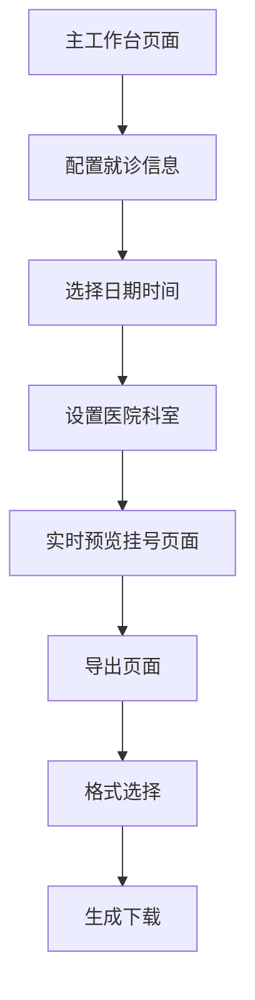

# 挂号页面生成器产品需求文档

## 1. Product Overview

挂号页面生成器是一个专门用于医疗挂号页面设计的可视化工具，能够快速生成标准化的挂号预约成功页面。用户可以通过右侧配置面板设置就诊信息，左侧实时预览挂号页面效果，并支持导出功能。

- 主要解决医疗机构、软件开发商快速生成标准化挂号页面的需求
- 目标用户包括医疗机构IT人员、医疗软件开发者、产品设计师等
- 产品价值在于提供高效的医疗挂号页面生成工具，标准化挂号流程展示

## 2. Core Features

### 2.1 Feature Module

我们的挂号页面生成器包含以下核心页面：

1. **主工作台页面**：左侧挂号页面预览区域、右侧挂号信息配置面板、顶部工具栏
2. **导出页面**：图片格式选择、质量设置、页面导出

### 2.2 Page Details

| Page Name | Module Name | Feature description |
|-----------|-------------|---------------------|
| 主工作台页面 | 预览区域 | 实时显示挂号预约成功页面，包含预约成功状态、挂号信息详情展示 |
| 主工作台页面 | 配置面板 | 就诊人姓名输入、身份证号码输入、就诊日期选择、医院名称设置、科室选择 |
| 主工作台页面 | 工具栏 | 重置配置、导出页面、预览模式切换 |
| 导出页面 | 格式设置 | 选择PNG、JPG格式，设置图片质量和尺寸 |
| 导出页面 | 导出功能 | 单页导出、预览导出效果、下载功能 |

## 3. Core Process

**主要用户操作流程：**

1. 用户进入主工作台页面
2. 在右侧配置面板输入就诊人信息（姓名、身份证）
3. 选择就诊日期和时间段
4. 设置就诊医院和科室信息
5. 左侧实时预览挂号页面效果
6. 点击导出按钮进入导出页面
7. 选择导出格式和参数
8. 生成并下载挂号页面图片

## 4. User Interface Design

### 4.1 Design Style

- **主色调**：#2563eb（蓝色）、#f8fafc（浅灰背景）
- **辅助色**：#64748b（中性灰）、#10b981（成功绿）、#ef4444（警告红）
- **按钮样式**：圆角矩形，悬停效果，阴影设计
- **字体**：Inter字体，标题16-20px，正文14px，说明文字12px
- **布局风格**：现代化卡片式设计，左右分栏布局，顶部导航
- **图标风格**：线性图标，统一的视觉语言，支持主题色彩

### 4.2 Page Design Overview

| Page Name | Module Name | UI Elements |
|-----------|-------------|-------------|
| 主工作台页面 | 预览区域 | 手机界面模拟器，挂号成功页面展示，蓝色主题色彩，预约成功图标 |
| 主工作台页面 | 配置面板 | 表单输入框，日期选择器，下拉选择器，实时验证提示 |
| 主工作台页面 | 工具栏 | 重置按钮，保存按钮，导出按钮，预览切换开关 |
| 模板管理页面 | 模板列表 | 卡片式模板展示，挂号页面缩略图，操作按钮 |
| 导出页面 | 设置面板 | 格式选择单选框，质量滑块，尺寸设置，预览窗口 |

### 4.3 Responsiveness

产品采用桌面优先设计，针对1920x1080及以上分辨率优化。支持最小1366x768分辨率，通过响应式布局适配不同屏幕尺寸。预览区域支持触控操作优化，便于触屏设备使用。