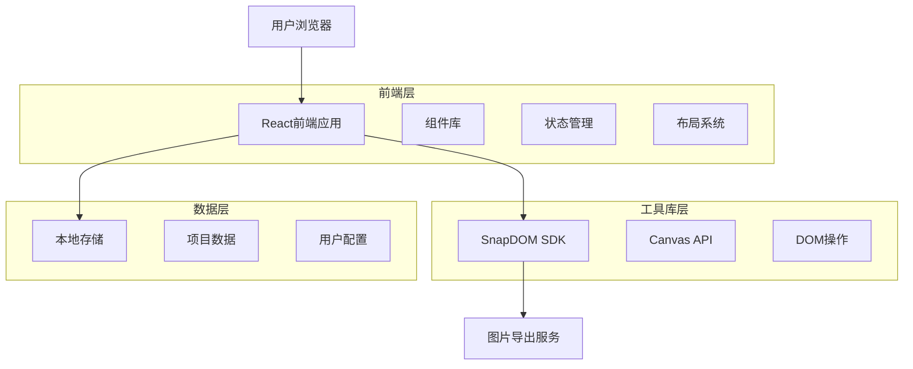
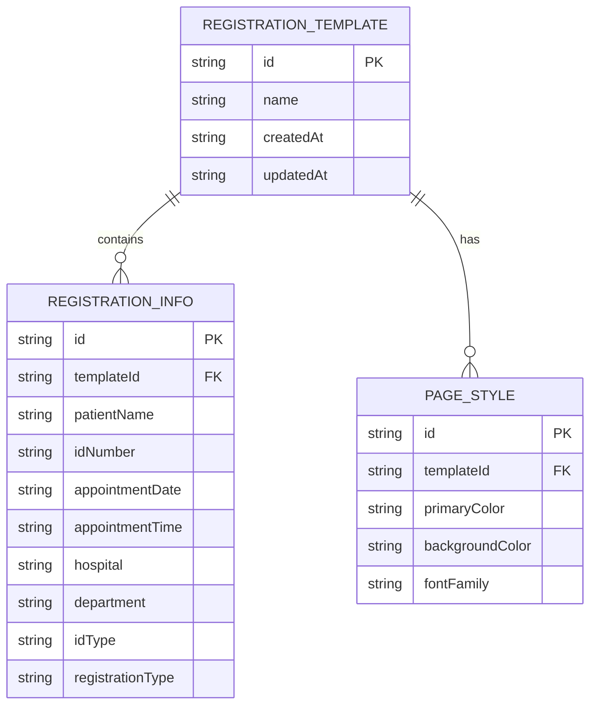

# 挂号页面生成器技术架构文档

## 1. Architecture design



## 2. Technology Description

- Frontend: React@18 + TypeScript@5 + Vite@5 + TailwindCSS@3
- UI Library: Lucide React (图标库)
- Image Export: snapdom@latest
- State Management: Zustand@4
- Storage: LocalStorage (项目数据持久化)

## 3. Route definitions

| Route | Purpose |
|-------|---------|
| / | 主工作台页面，左侧挂号页面预览，右侧就诊信息配置 |
| /export | 导出页面，配置导出参数和生成挂号页面图片 |

## 4. API definitions

### 4.1 Core API

**图片导出相关**
```typescript
// 导出配置接口
interface ExportConfig {
  format: 'png' | 'jpg' | 'webp';
  quality: number; // 0-1
  width?: number;
  height?: number;
  scale: number; // 1-3
}

// 导出结果接口
interface ExportResult {
  success: boolean;
  dataUrl?: string;
  blob?: Blob;
  error?: string;
}

// 导出函数
exportToImage(element: HTMLElement, config: ExportConfig): Promise<ExportResult>
```

**挂号信息数据相关**
```typescript
// 挂号信息接口
interface RegistrationInfo {
  patientName: string; // 就诊人姓名
  idNumber: string; // 身份证号码
  appointmentDate: string; // 就诊日期
  appointmentTime: string; // 就诊时间段
  hospital: string; // 就诊医院
  department: string; // 就诊科室
  idType: string; // 挂号证件类型
  registrationType: string; // 就诊类型（自费/医保等）
}

// 挂号页面模板接口
interface RegistrationTemplate {
  id: string;
  name: string;
  registrationInfo: RegistrationInfo;
  pageStyle: {
    primaryColor: string;
    backgroundColor: string;
    fontFamily: string;
  };
  createdAt: string;
  updatedAt: string;
}
```

## 5. Data model

### 5.1 Data model definition



### 5.2 Data Definition Language

**LocalStorage数据结构**

```typescript
// 挂号页面存储键值
const STORAGE_KEYS = {
  CURRENT_REGISTRATION: 'registration_generator_current',
  USER_SETTINGS: 'registration_generator_settings'
};

// 初始化默认挂号信息
const DEFAULT_REGISTRATION_INFO: RegistrationInfo = {
  patientName: '张三',
  idNumber: '130****13',
  appointmentDate: '2025年09月17日 周三',
  appointmentTime: '09:30~10:00',
  hospital: '北京大学人民医院',
  department: '感染科门诊',
  idType: '居民身份证',
  registrationType: '自费'
};

// 用户设置接口
interface UserSettings {
  theme: 'light' | 'dark';
  autoSave: boolean;
  exportQuality: number;
  defaultHospital: string;
  defaultDepartment: string;
}

// 默认页面样式
const DEFAULT_PAGE_STYLE = {
  primaryColor: '#4A90E2',
  backgroundColor: '#F5F5F5',
  fontFamily: 'PingFang SC, Microsoft YaHei, sans-serif'
};
```

**状态管理Store结构**

```typescript
// 挂号页面应用状态
interface RegistrationStore {
  // 挂号信息
  registrationInfo: RegistrationInfo;
  
  // UI状态
  previewMode: 'mobile' | 'desktop';
  isExporting: boolean;
  
  // 操作方法
  updateRegistrationInfo: (updates: Partial<RegistrationInfo>) => void;
  resetRegistrationInfo: () => void;
  setPreviewMode: (mode: 'mobile' | 'desktop') => void;
  
  // 导出功能
  exportToImage: (config: ExportConfig) => Promise<ExportResult>;
  
  // 数据持久化
  saveToStorage: () => void;
  loadFromStorage: () => void;
}
```